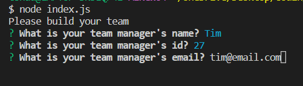
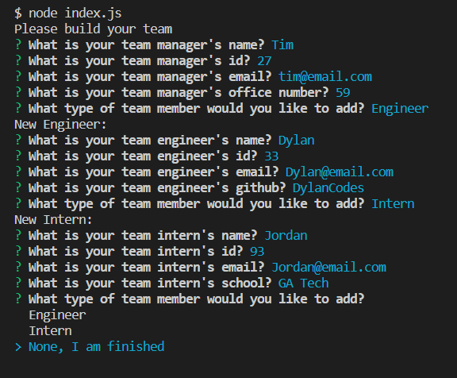

# Team-Profile-Generator
## Description
This application allows you to create a webpage about employees and their relevant information. Using Node, the user can fill out information about their employees using prompts, and once complete, a new index.HTML page will be created that displays the employee information.

## Photos

## Installation
Run "npm i" in the integrated terminal to install all npm packages.

Run "node index.js" in the integrated terminal to begin the application.

## Questions
For any questions, please contact me at my email: tshadday99@gmail.com. You can also checkout my GitHub: [tshadday](https://github.com/tshadday).